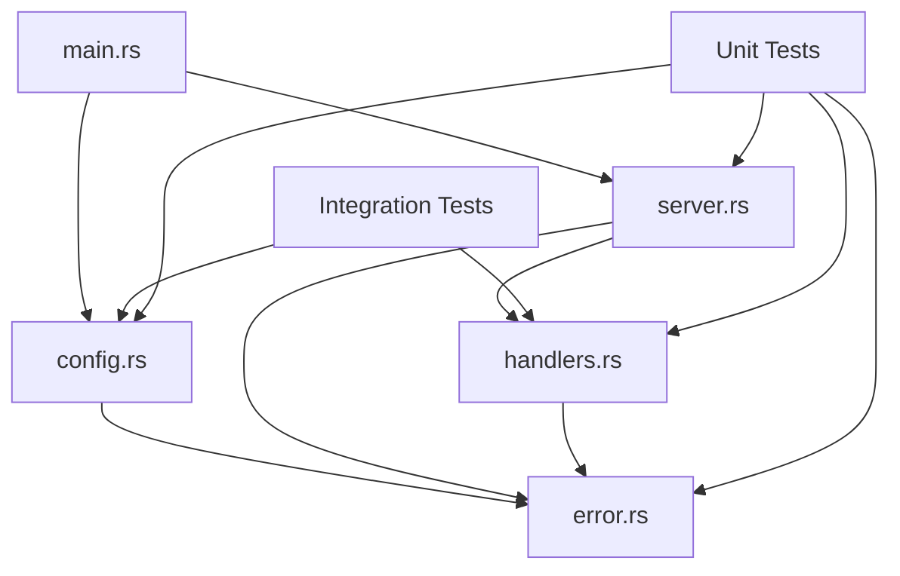

# Module Architecture - Core Components

## 📁 Module Breakdown

### 🚀 main.rs - Application Entry Point
```rust
// Clean, focused entry point
#[actix_web::main]
async fn main() -> Result<(), Box<dyn std::error::Error>>
```

**Responsibilities:**
- Initialize logging with environment configuration
- Load application configuration from environment variables
- Create and start the server manager
- Handle top-level application errors

**Key Features:**
- Proper error handling with custom error mapping
- Environment-based logging configuration
- Clean separation from business logic

---

### ⚙️ config.rs - Configuration Management

**Core Structure:**
```rust
#[derive(Debug, Clone)]
pub struct Config {
    pub main_port: u16,
    pub app_port: u16, 
    pub bind_address: String,
}
```

**Key Features:**
- Environment variable parsing with defaults
- Custom error types for configuration issues
- Port validation (1-65535 range)
- Thread-safe configuration sharing

**Environment Variables:**
- `PORT`: Main server port (default: 8080)
- `PORT_APP`: Application server port (default: 4242)
- `BIND_ADDRESS`: Server bind address (default: "0.0.0.0")

**Error Handling:**
- Custom `AppError::environment()` for invalid port values
- Descriptive error messages for debugging
- Graceful fallback to defaults

---

### 🚨 error.rs - Custom Error Handling

**Error Hierarchy:**
```rust
#[derive(Error, Debug)]
pub enum AppError {
    Config { message: String },
    Server { message: String },
    Environment { var_name: String, message: String },
    Internal { message: String },
    Validation { message: String },
}
```

**Key Features:**
- Implements `ResponseError` for HTTP responses
- Structured JSON error responses
- Appropriate HTTP status code mapping
- Timestamp inclusion for debugging

**Response Format:**
```json
{
  "error": {
    "type": "configuration_error",
    "message": "PORT must be a valid port number (1-65535), got: invalid",
    "timestamp": "2024-01-15T10:30:00Z"
  }
}
```

---

### 🌐 handlers.rs - HTTP Request Handlers

**Organization:**
```rust
pub mod main_server {
    pub async fn hello() -> ActixResult<HttpResponse>
}

pub mod app_server {
    pub async fn root() -> ActixResult<HttpResponse>
    pub async fn public_route() -> ActixResult<HttpResponse>
    pub async fn private_route() -> ActixResult<HttpResponse>
}
```

**Response Types:**
- **Main Server**: Plain text responses with proper content-type
- **App Server**: Structured JSON with metadata and timestamps

**API Design:**
- RESTful conventions
- Consistent response formats
- Health check endpoints
- CORS-compatible headers

---

### 🖥️ server.rs - Server Management

**Core Component:**
```rust
pub struct ServerManager {
    config: Config,
}
```

**Responsibilities:**
- Concurrent server startup (main + app servers)
- CORS configuration management
- Middleware setup (logging, CORS)
- Graceful shutdown handling
- Health check endpoint registration

**CORS Configuration:**
- Allow any origin for development
- Standard HTTP methods (GET, POST, PUT, DELETE, OPTIONS)
- Common headers (Authorization, Accept, Content-Type)
- 1-hour cache age

**Middleware Stack:**
1. CORS handling
2. Request/response logging
3. Route handling

---

## 🔄 Module Interactions



**Data Flow:**
1. `main.rs` loads configuration via `config.rs`
2. Configuration passed to `ServerManager` in `server.rs`
3. Servers created with handlers from `handlers.rs`
4. All modules use custom errors from `error.rs`
5. Tests validate all components independently and together